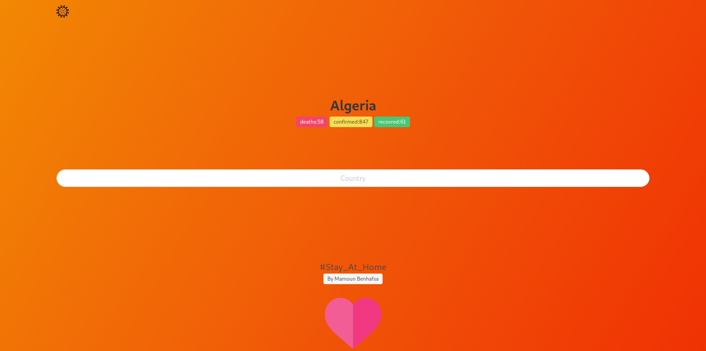

# Covid-19 (PHP API) WIBSITE TO GET COVID-19 STATISTICS

The API Work With Curl The Front End Designed Using Bulma-css 

  - You Must Get An API Key From RAPID API https://rapidapi.com/KishCom/api/covid-19-coronavirus-statistics
  -Try var_dump(response) You Can Add Some Items

